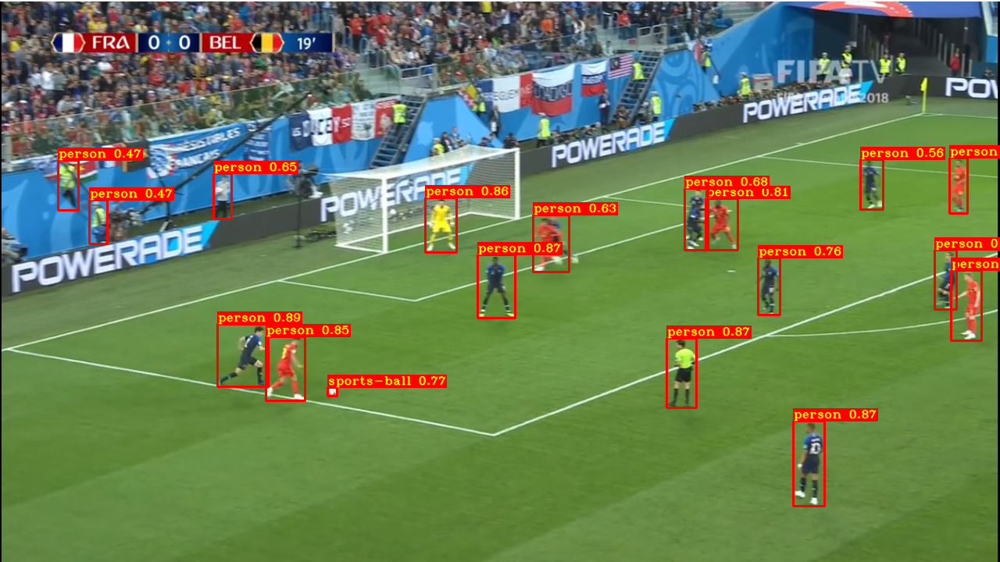
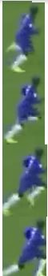
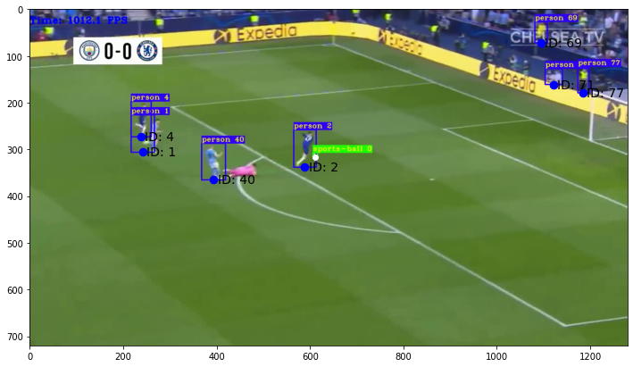
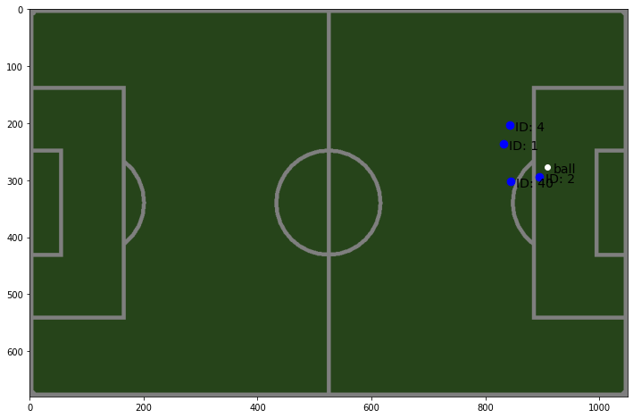
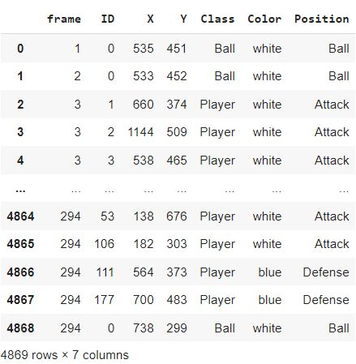

# Introduction

This repo for extracting tracking data from broadcast TV feed using AI to analyze football matches in 3 main steps

### 1 - Players / ball **Detection**

we used YOLOv5 PyTorch Hub inference, to load pretrained **YoloV5l** model,
<br > for more visit:
[ultralytics/yolov5](https://github.com/ultralytics/yolov5)
<br >

<div align="center">

</div>

### 2 - Players / ball **Tracking**

our tracker was built on top of **Deep SORT** algorithm, <br > which was implemented in [nwojke/deep_sort](https://github.com/nwojke/deep_sort)
<br >

<div align="center">

</div>

### 3 - **Projection** to a 2D pitch

we used resnet model trained on many footages of football pitches from [sportsfield_release](https://github.com/vcg-uvic/sportsfield_release) to generate projection matrix to map the TV video into 2D 1080\*680 football pitch
<br >

<div align="center">


</div>

### finally after step 3 the tracking data of the TV footage is generated, and could by used to get whatever statistics and insights we want.

<br >
<div align="center">

</div>

# Installation

    #clone the repo
    git clone https://github.com/JooZef315/football-tracking-data-from-TV-broadcast
    #go to the directory
    cd football-tracking-data-from-TV-broadcast/
    #install the dependencies
    pip install -r requirements.txt # install

### pretrained weights

Then Download the pretrained weights for the resnet model from [HERE!](https://drive.google.com/uc?id=1kgc6wfgdIDsHBhFMAr6YwTWbrigNv_UB&export=download)
<br >
Extract all the content of the downloaded 'out.zip', and move the 2 extracted folders to <br >
`./projection_2D/pretrained_weights/out/`

# Usage

The basic usage of this repo is to generate tracking data dataframe:

```python
from Detect_and_Track.get_init_data import get_init_data
from projection_2D.get_tracking_data import get_tracking_data

#call get_init_data function with arguments:
#TV video path, a name to name output video and the intial dataframe(with unmapped coordinates relative to TV video),
#and list of two teams colors as described in create_df.py file, and whether or not to save only the frames with the ball detected in them.
get_init_data(path, out_name, teams_colors, ball_only):

#the output video with players and ball tracked, and  the intial dataframe would be saved in Out/
#use them as arguments to get_tracking_data function, to generate the final tracking data dataframe

tracked_frames, bboxes = get_tracking_data(df_path, tracked_video_path, out_name)
#the output is a dataframe with players and ball tracked and mapped to 2D pitch,  which would be saved in "Out/" too.
```

<br >

to use it for players/ball detection only

```python
from Detect_and_Track.demo_detection import detect_demo

#call detect_demo with path of any image of a football match footage, the function would show the image with players and ball detected, and return the coordinates of the bounding boxes

detect_demo(img_path)
```

<br >

to use it for players/ball detection and tracking only

```python
from Detect_and_Track.get_tracks import get_video_tracks
from Detect_and_Track.create_tracking_boxes_video import create_tracking_boxes_video

#call get_video_tracks with path of any football match footage,
# for more info see Detect_and_Track/get_tracks file
#the function would save new clean video without zoomed in frames in "Out/" folder with the chosen name
get_video_tracks(video_path, output_video_name)

#and to create the video with tracking boxes around players
#the function would save new video with playerrs/ball tracked -each with unique ID-, in "Out/" folder with the chosen name
create_tracking_boxes_video(video_path, output_video_name)
```

<br >

#### you could generate tracking data,

#### or play with our demo functions using the jupyter **notebook** provided here.

<br >

# License

This project is licensed under the **MIT** - see the LICENSE file for details
